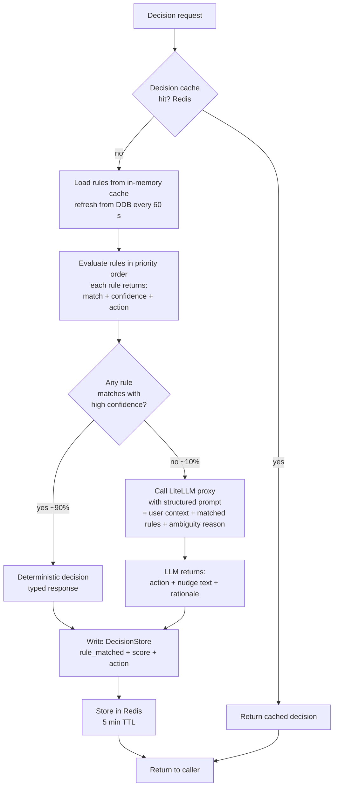
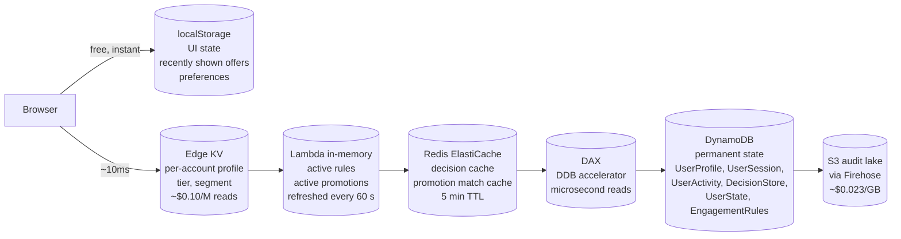
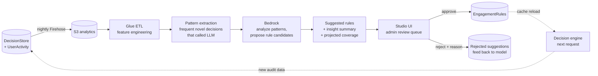

# Signal Force Architecture - Decision Engine

Last updated: 2026-05-21

The central insight: most decisions are not novel. Past patterns repeat. Rules resolve first,
cheaply. AI handles the remaining cases. This keeps per-decision cost under $0.001 at demo
traffic and projects well to Bonvoy scale.

## Contents

- [Rules-first engine](#rules-first-engine-ai-when-needed-not-by-default)
- [Storage tiering](#storage-tiering)
- [Studio loop](#studio-loop-ai-improving-rules-over-time)
- [Stateful surfaces](#stateful-surfaces-get-customersurface-eligibility)
- [Demo events and activity feed](#demo-events-and-activity-feed)
- [Decision flows](#decision-flows)

---

## Rules-first engine: AI when needed, not by default

### Flow



### Rule shape (EngagementRules table)

```json
{
  "ruleId": "RULE#TIER_GAP_NUDGE",
  "version": "latest",
  "name": "Tier gap nudge",
  "status": "ACTIVE",
  "definition": {
    "conditions": {
      "all": [
        { "fact": "signal", "operator": "equal", "value": "tier_gap" },
        { "fact": "pointsToNextTier", "operator": "lessThanInclusive", "value": 10000 }
      ]
    },
    "event": {
      "type": "TIER_GAP",
      "params": { "action": "NUDGE", "surface": "inline_card", "score": 75 }
    }
  },
  "updatedAt": "2026-05-21T00:00:00Z"
}
```

Rule evaluator walks each active rule for the trigger in priority order. If all conditions match
and confidence >= threshold (default 0.85), the engine returns the rule's action deterministically.
Otherwise it falls through to the warm lane.

### Why this saves money

Real-time AI calls drop by ~90% compared to calling the LLM on every request. Rule changes do
not require code deploys - an admin edits a rule in the studio and the engine picks it up within
60 seconds (rule cache refresh). Every audit row says which rule fired or why the LLM was called,
so decisions are explainable by default.

---

## Storage tiering

The cost story is shaped by storage as much as compute. Most reads stop early.



| Tier | Use for | Cost per million reads | Latency |
|---|---|---|---|
| Browser localStorage | UI state, last 10 actions, preferences, recently shown offers | $0 | instant |
| Edge KV | User profile, tier, segment, eligibility cache | ~$0.10 | ~10ms |
| Lambda in-memory | Active rules, active promotions | $0 (free during warm) | ~1ms |
| Redis | Decision cache, promotion match cache | ~$0.50 | <5ms |
| DAX | UserProfile, UserState hot reads | ~$1.00 | microsecond |
| DynamoDB | Audit, writes, less-frequent reads | ~$1.25 reads / $1.25/M writes | ~5-10ms |
| S3 | Audit lake, analytics raw | ~$0.40 | seconds (Athena) |

What does not move to the browser:

- Trust signals (geo, device fingerprint, fraud flags) live server-side only.
- Audit trail is append-only on DDB, replicated to S3 via Firehose.
- Rules and promotions are server-side authoritative. Browser only caches the rendered decision, not the rule.

---

## Studio loop: AI improving rules over time

This is the loop that compounds value. AI cost drops as rule coverage grows.



The loop:

1. Engine writes every decision to DecisionStore (rule_matched, LLM_called, action, latency, cost).
2. Nightly Firehose batches DDB writes into S3.
3. Glue extracts patterns from cases that hit the LLM (the novel cases that cost money).
4. A separate Bedrock call (cold lane, batch) analyzes clustered novel cases and proposes new rule candidates with projected coverage and confidence.
5. Studio UI shows the admin a queue of suggested rules with stats: "this rule would have handled 412 of the last 1000 LLM-called decisions with 95% confidence, saving an estimated $X/month."
6. Admin reviews, approves, or rejects with a reason (rejection feeds back into the proposer).
7. Approved rules go live. Engine picks them up on the next cache refresh.
8. The next batch of audit data shows fewer LLM calls. Loop tightens.

The studio also generates insights graphs:
- Decision volume per surface, per action
- Rule hit rate per rule (which rules earn their keep)
- Novel pattern frequency over time
- Fraud catch rate vs false positive rate
- Promotion conversion by segment

---

## Stateful surfaces (GET /customer/surface-eligibility)

The surface evaluator (`engine/surfaces.js`) tracks lifecycle state per user for six named
surfaces. State is derived from `UserProfile` and `UserState` fields at read time - there is no
separate state row.

Surface lifecycle:

```
HIDDEN  --[threshold crossed]--> SHOWN
SHOWN   --[action taken]-------> PENDING
PENDING --[mutation applied]---> COMPLETED (within 60 s window)
SHOWN   --[goal reached]-------> HIDDEN  (e.g. user already at top tier)
```

The six surfaces and their trigger thresholds:

| Surface ID | Shown when | Completed when |
|---|---|---|
| `PROPERTY_PRESTIGE_ADVANCE` | `loyaltyScore` within 10,000 pts of Platinum | `platinumReachedAt` within last 60 s |
| `RESULTS_PRESTIGE_ADVANCE` | Same threshold as above | Same |
| `PROFILE_CATALYST_ELEVATE` | `profileCompletion < 90` and tier below Platinum | `profileCompletionReachedAt` within last 60 s |
| `MFA_ENROLLMENT_NUDGE` | Gold or Platinum member without `mfaSecret` | `mfaEnrolledAt` within last 60 s |
| `TRANSFER_ABANDON_OFFER` | Stale `transferDraft` in UserState (>60 s old) | `lastTransferCompletedAt` within last 60 s |
| `BOOKING_CONFIRMATION_OFFER` | `recentBookingAt` within last 300 s | `bookingOfferDismissedAt` set after booking |

The DemoPanel "Quick Mutations" row fires `POST /admin/demo-actions/mutate-user` to flip these
fields directly so a presenter can walk through any surface state during a live demo.

---

## Demo events and activity feed

### Demo events (`routes/admin/demo-events.js`)

`POST /admin/demo-events` records operator actions from the DemoPanel as `DEMO_EVENT` rows in
`UserActivity`. Each row carries a `type` (e.g. `USER_SWITCH`, `MFA_FORCED`, `SIGNAL_TRIGGER`),
an optional `actor`, and a free-form `payload`. The activity feed and the admin live-ticker
display these alongside real decisions and sessions.

### Activity feed (`routes/admin/activity-feed.js`)

`GET /admin/activity-feed?since=<epochMs>&limit=<n>` merges three sources into one
chronological stream:

1. `DecisionStore` rows with `timestamp > since`
2. `UserSession` ACCESS rows with `lastActivityAt > since`
3. `UserActivity` rows with `activityType = DEMO_EVENT` and `timestamp > since`

Events are sorted newest-first, capped at 100, and returned with a `nextCursor` (epoch ms of
the newest event) for incremental polling. The `kind` field distinguishes each source:
`DECISION`, `SESSION`, or `DEMO_EVENT`. The `LiveActivityFeed` hero widget on the admin
overview polls this endpoint every few seconds.

---

## Decision flows

### Auth + fraud check (login path)

```
client                Lambda                       DDB
  | POST /auth/login { username, password, location, deviceId }
  +-------------------->| load UserProfile
  |                     +---------------------------->|
  |                     |<----------------------------+
  |                     | evaluate L1 rules (score heuristics)
  |                     |
  |                     | if score < 40 (clean):
  |                     |   write UserSession ACCESS row
  |                     |   write DecisionStore FRAUD_LOGIN ALLOW
  |                     |   return { token }
  |                     |
  |                     | if score 40-70 (gray zone):
  |                     |   call LiteLLM classify -------> LiteLLM
  |                     |<-----------------------------------+
  |                     |   write CHALLENGE row
  |                     |   write DecisionStore FRAUD_LOGIN MFA
  |                     |   return { status: MFA_REQUIRED, sessionId }
  |                     |
  |                     | if score > 70 (high risk):
  |                     |   write DecisionStore FRAUD_LOGIN BLOCK
  |                     |   return { status: BLOCKED }
  |<--------------------+ 200
```

### Admin live rule edit

```
admin                 Lambda                       DDB
  | PUT /admin/rules/RULE%23abc123 { ... }
  +-------------------->| validate JSON shape
  |                     | PutItem on EngagementRules (version=ISO timestamp as history)
  |                     | PutItem on EngagementRules (version=latest as live row)
  |                     | bustCache() clears in-memory rule list
  |                     +---------------------------->|
  |<--------------------+ 200 { ruleId, version }

Change is live for new requests immediately on this Lambda container.
Other containers pick it up within 60 seconds (cache TTL).
```

---

Related: [architecture-overview.md](./architecture-overview.md) | [architecture-ai.md](./architecture-ai.md) | [rule-editor.md](./rule-editor.md)
