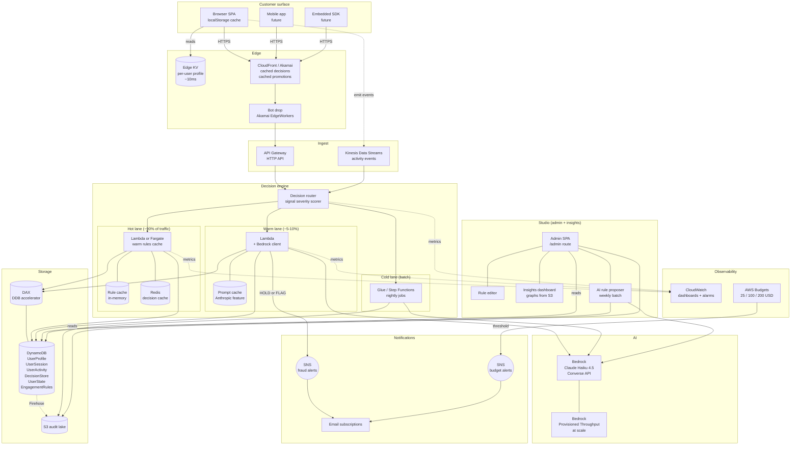
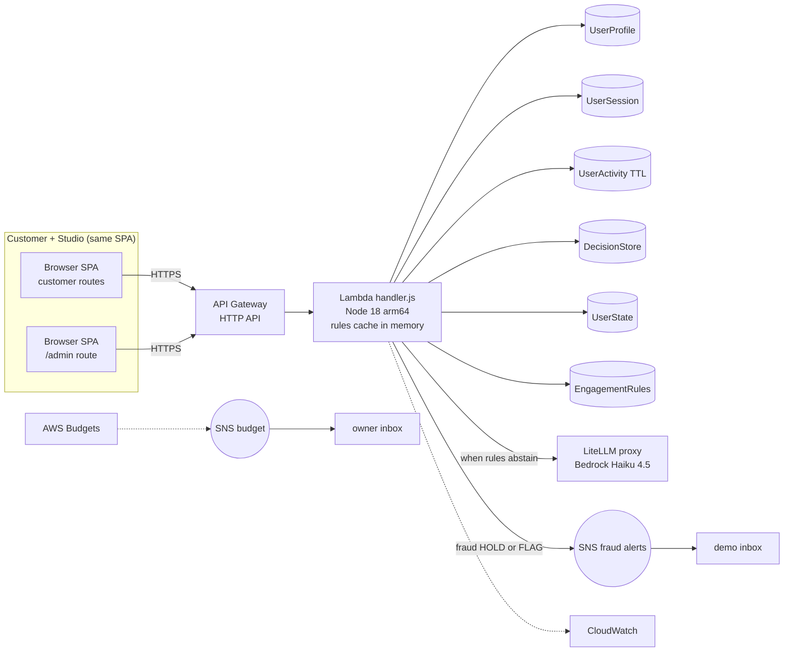
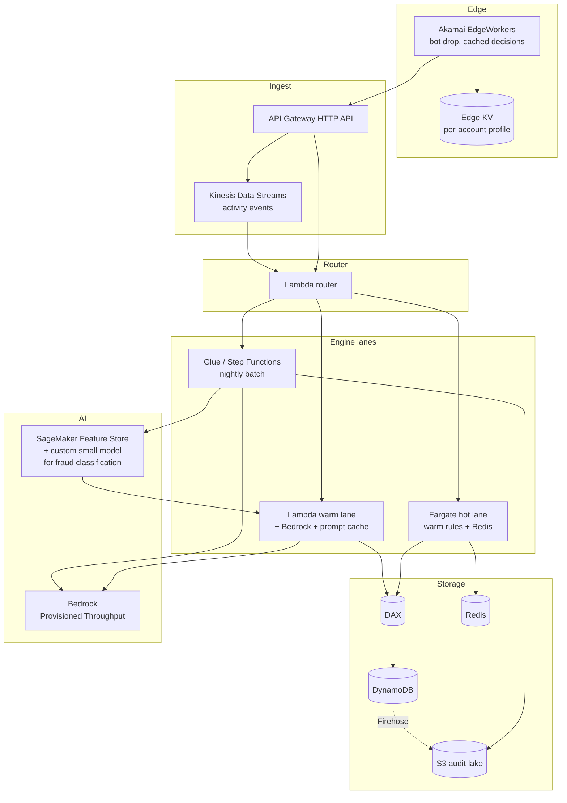

# Signal Force Architecture - Overview

Last updated: 2026-05-21

One engine that turns customer signals into adaptive decisions across security, personalization,
and engagement. Rules resolve first, cheaply. AI handles the cases rules cannot decide.
Every decision is auditable. The admin studio lets ops tune rules without a deploy.

## Contents

- [System overview](#system-overview)
- [Three apps](#three-apps)
- [Demo stack (what ships)](#demo-stack-what-ships)
- [Production shape](#production-architecture)
- [Cost (demo)](#cost-demo)
- [DynamoDB tables](#dynamodb-tables-as-deployed)
- [MFA implementation](#mfa-implementation)
- [Frontend components](#frontend-components)
- [CDK stacks](#stacks)
- [Service selection](#service-selection-demo-stack)
- [Decision log](#decision-log)
- [Operational notes](#operational-notes)

See also:
- [architecture-engine.md](./architecture-engine.md) - rules-first engine, storage tiering, studio loop
- [architecture-ai.md](./architecture-ai.md) - AI fraud explainer, surface prioritizer, LiteLLM topology, budget guard
- [deployment.md](./deployment.md) - step-by-step deploy runbook
- [api-quickstart.md](./api-quickstart.md) - HTTP examples for every route

---

## System overview

The full picture: all three apps, all the storage tiers, the studio loop, edge cache, batch
pipeline, audit lake. This is where the platform is heading. The demo runs a tractable subset.



Read it in three passes:

1. Follow a customer event: Browser to Edge to API to Router to Hot Lane to DDB and back.
2. Follow a suspicious event: same up to Router, then Warm Lane to Bedrock to SNS plus DDB write.
3. Follow the studio loop: DDB to S3 to Proposer to Bedrock to suggested rules to Studio UI to admin approval to Rule table to next request hot-lane evaluation.

---

## Three apps

```
+--------------------+      +---------------------+      +----------------------+
| Customer surface   |      | Decision engine     |      | Studio (admin+ops)   |
|                    |      |                     |      |                      |
| Renders decisions: |<---->| Returns typed       |<---->| Rule editor          |
| popups, nudges,    | API  | response per event: | API  | Insights graphs      |
| holds, offers.     |      | { risk, offers,     |      | AI rule proposer     |
|                    |      |   nudge, action }   |      | Audit log            |
| Bonvoy app in prod |      |                     |      |                      |
| SPA in demo.       |      | Rules-first, LLM    |      | SPA /admin route     |
+--------------------+      | only when rules     |      +----------------------+
                            | abstain.            |
                            +---------------------+
```

| App | Built where (demo) | Built where (production) |
|---|---|---|
| Customer surface | `apps/frontend/` `/login`, `/dashboard` routes | Bonvoy app or SDK embedded on partner sites |
| Decision engine | `apps/backend/src/handler.js` Lambda | Split into hot + warm + cold lanes |
| Studio | `apps/frontend/src/pages/admin/` route in same SPA | Separate app, Cognito-protected |

---

## Demo stack (what ships)

A tractable subset of the full picture. Three CDK stacks. One Lambda. No edge KV, no Redis,
no Kinesis. Rules cached in Lambda memory. LLM called when rules abstain.



Six DynamoDB tables: UserProfile, UserSession, UserActivity (TTL), DecisionStore, UserState,
EngagementRules. All PAY_PER_REQUEST.

---

## Production architecture

The shape it takes at Bonvoy scale (170 M members).



What changes from the demo stack:

- **Edge layer added**: Akamai EdgeWorkers + Edge KV for per-account profile cache.
- **Engine split**: Fargate for the hot lane (warm rule cache, persistent Redis connections). Lambda for the warm LLM lane. Glue for cold batch.
- **DAX in front of DDB**: microsecond reads on the hot tables.
- **Bedrock Provisioned Throughput**: commit to a base TPS for 30-70% discount.
- **SageMaker Feature Store**: real-time features for fraud classification, fed by Kinesis.
- **Custom fraud model on SageMaker**: trained on DecisionStore replay set, replaces some Bedrock calls with cheaper inference for the well-understood fraud branch.

---

## Cost (demo)

| Service | Cost over the event |
|---|---|
| Lambda, API Gateway, DynamoDB (free tier) | $0.00 |
| Claude Haiku 4.5 via LiteLLM proxy (~500 calls) | ~$0.80 |
| SNS, CloudWatch, S3 (free tier) | $0.00 |
| AWS Budgets | ~$0.10 |
| **Total** | **~$1.00** |

The $250 cap is not at risk.

---

## DynamoDB tables (as deployed)

Six tables in `signal-force-dynamodb`. All PAY_PER_REQUEST with PITR enabled.

| Table | PK | SK | GSI | Stores |
|---|---|---|---|---|
| `UserProfile` | `userId` (S) | - | `username-index` (PK: `username`) | Loyalty member directory, MFA secret, tier, profile fields |
| `UserSession` | `sessionId` (S) | - | `userId-index` (PK: `userId`) | Bearer sessions. `recordType: ACCESS` for active tokens, `CHALLENGE` for MFA challenges |
| `UserActivity` | `userId` (S) | `activityTime` (N) | - (TTL on `ttl`) | Append-only event log per user. DEMO_EVENT rows share this table |
| `DecisionStore` | `decisionId` (S) | - | `userId-timestamp-index` (PK: `userId`, SK: `timestamp`) | Every engine decision. GSI enables per-user queries with time range in `KeyConditionExpression` |
| `UserState` | `userId` (S) | - | - | Rolling counters and surface lifecycle timestamps per user |
| `EngagementRules` | `ruleId` (S) | `version` (S) | - | Rule documents. `version=latest` is the live row; ISO timestamps are history entries |

The `DecisionStore` GSI (`userId-timestamp-index`) is used by `GET /admin/decisions?userId=` to
query by user with a timestamp range in the `KeyConditionExpression` (not a `FilterExpression`),
giving O(log n) lookup instead of a table scan (PR #88, #94).

---

## MFA implementation

The demo Lambda runs with `MFA_MODE=static` and `DEMO_MODE=1` (both set in the CDK runtime
stack). `MFA_MODE=static` means any login or transfer MFA challenge accepts OTP `123456` as a
fallback alongside real TOTP codes. The `mfaPath` field in the response records which path
succeeded (`TOTP` or `STATIC`) for audit purposes.

The TOTP secret is stored as `mfaSecret` on the `UserProfile` item. A `CHALLENGE` row is written
to `UserSession` when the fraud engine returns `action: MFA`. After `POST /auth/mfa/verify`
accepts the code, an `ACCESS` row is written keyed by the opaque bearer token, so token lookup
is O(1) without a secondary index. Every authenticated customer request calls `validateBearer`,
which also slides the row's `expiresAt` forward by `SESSION_TTL_SEC` (default 1800 s).

---

## Frontend components

Added since 2026-05-20:

- `DemoPanel` - Surface Eligibility section, Quick Mutations row, AI Mode toggle (PRs #103, #111, #122)
- `LiveActivityFeed` - hero widget on admin overview, merges all event kinds (PR #112)
- `DecisionDrawer` - "AI Analysis" panel renders `aiExplanation` from fraud decisions (PR #122)
- Engine guard tile - black-themed, compact, sub-cent USD cost display (PRs #117, #118)
- TopBar dec/s meter - switched to TanStack Query with EMA smoothing (PR #106)
- Force-MFA-on-demo checkbox on login page when `DEMO_MODE=1` (PR #96)
- Engagement detectors wired on `/search`, `/results`, `/property`, `/transfer`, `/profile` (PR #97)
- Two-step booking flow with AI personalized offer surface (PR #137)
- Session guard on protected customer routes (PR #138)

---

## Stacks

Three CDK stacks. All on `main`.

| Stack | Status | Contents |
|---|---|---|
| `signal-force-dynamodb` | deployed | 6 DynamoDB tables: UserProfile, UserSession, UserActivity (TTL), DecisionStore, UserState, EngagementRules |
| `signal-force-budgets` | deployed | 3 monthly budgets (25 / 100 / 200 USD) with SNS email alerts |
| `signal-force-runtime` | deployed | Lambda + HTTP API + IAM + Bedrock IAM (prod-path, unused on LiteLLM demo path) + fraud-alert SNS + CloudWatch dashboard |

---

## Service selection (demo stack)

**Compute: Lambda Node.js 18 arm64.** For the demo. For production the hot lane moves to Fargate
(warm rule cache, persistent Redis connections, no cold starts). Lambda stays for the warm LLM
lane and the cold batch jobs.

**API: API Gateway HTTP API.** HTTP API, not REST. Cheaper, faster, sufficient.

**Storage: DynamoDB on-demand.** Six tables, PAY_PER_REQUEST, `RemovalPolicy.DESTROY` for the
demo. Production flips to RETAIN and adds DAX.

**LLM: LiteLLM proxy (Claude Haiku 4.5 on Bedrock, OpenAI-compatible).** Lambda reads
`LITELLM_BASE_URL`, `LITELLM_API_KEY`, `LITELLM_MODEL`. The proxy speaks OpenAI wire format and
routes to Bedrock, so the Lambda does not need direct Bedrock model access. Active model id:
`us.anthropic.claude-haiku-4-5-20251001-v1:0` (US cross-region inference profile). The model
catalog is configurable via `apps/backend/src/lib/aiModels.js` and surfaced in the admin UI.

**Frontend hosting.** Next.js on Vercel (Hobby tier, free). The `signal-force-frontend` CDK
stack covers S3 + CloudFront as an optional alternative.

---

## Decision log

Each decision is closed. Reopening requires written rationale in a PR description.

1. **CDK TypeScript over CloudFormation YAML.** Type safety, L2 constructs, cdk diff workflow.
2. **HTTP API over REST API.** Cheaper, faster, sufficient.
3. **Single Lambda for the demo, tiered compute at scale.** Hot lane to Fargate, warm to Lambda, cold to Glue.
4. **Claude Haiku 4.5 via the Marriott LiteLLM proxy.** OpenAI-compatible wire format, Bedrock-backed, no direct Bedrock activation needed on the Lambda for the demo.
5. **Static MFA OTP over Cognito for the demo.** Half day saved. Cognito JWT is the next upgrade.
6. **Rules-first engine. AI when rules abstain.** 90% of decisions resolve via deterministic rules. LLM share drops over time as the studio loop adds rules.
7. **Three apps, one repo, one backend, two frontends (or two routes).** Customer + studio share the SPA in the demo. Production splits.
8. **Node.js for the demo, Python at the next major rewrite.** Better ML/LLM ecosystem.
9. **No Step Functions, Kinesis, EventBridge in the demo.** All correct at scale. None earn complexity at demo traffic.
10. **Tiered storage: browser, edge KV, Lambda memory, Redis, DAX, DDB, S3.** Reads stop at the cheapest tier they can.
11. **Studio AI runs in batch, not real-time.** Nightly pattern mining and rule proposing. Admin approval gate before live.
12. **Pre-cached LLM outputs over real-time LLM** for personalization. Daily batch generates offer variants per segment. Render-time pick is deterministic.

---

## Operational notes

- Region: us-east-1.
- Demo path uses the LiteLLM proxy, so no Bedrock model activation is required on the demo AWS account. Set `LITELLM_BASE_URL`, `LITELLM_API_KEY`, and `LITELLM_MODEL` on the Lambda (`./scripts/enable-litellm.sh` does this in one step).
- The production-path Bedrock IAM policy is retained in `infra/cdk/lib/runtime-stack.ts`. If the Lambda is ever switched to call Bedrock directly, Bedrock model access for Claude Haiku 4.5 in us-east-1 must be enabled in the AWS console first.
- Set `BUDGET_ALERT_EMAIL` and `FRAUD_ALERT_EMAIL` before `cdk deploy`.
- Confirm both SNS subscription emails after the first deploy.
- CloudWatch log groups have 1-day retention by default.
- Rule cache TTL in Lambda is 60 seconds. Set lower for faster admin feedback during the demo by adjusting `lib/ruleStore.js`.

---

Related: [architecture-engine.md](./architecture-engine.md) | [architecture-ai.md](./architecture-ai.md) | [deployment.md](./deployment.md)
