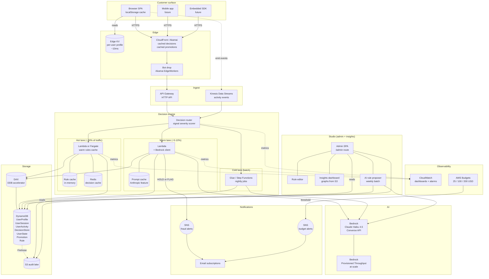
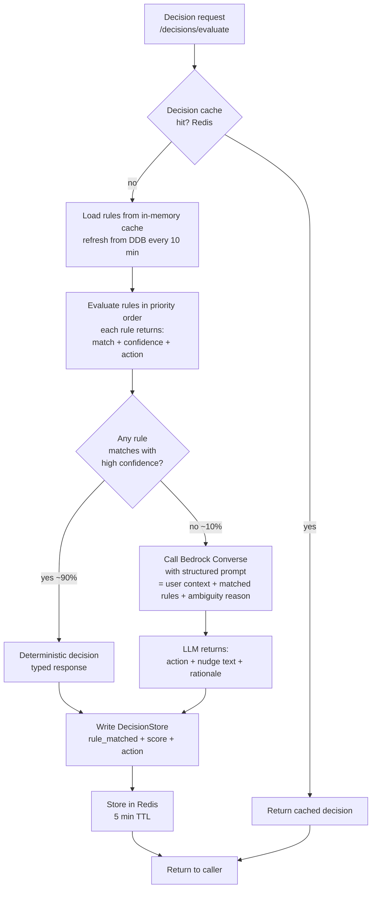
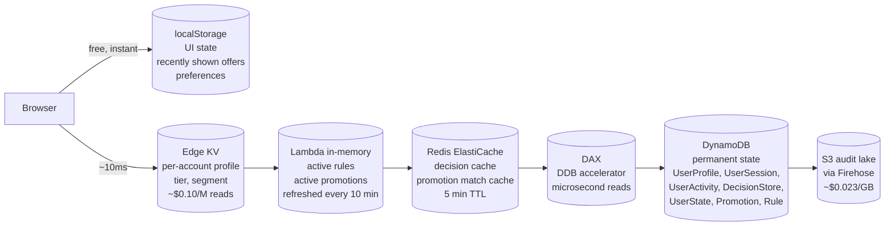
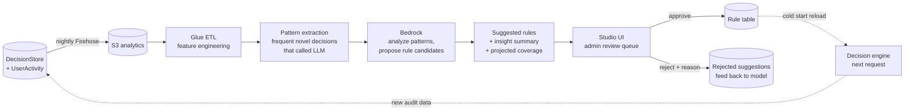
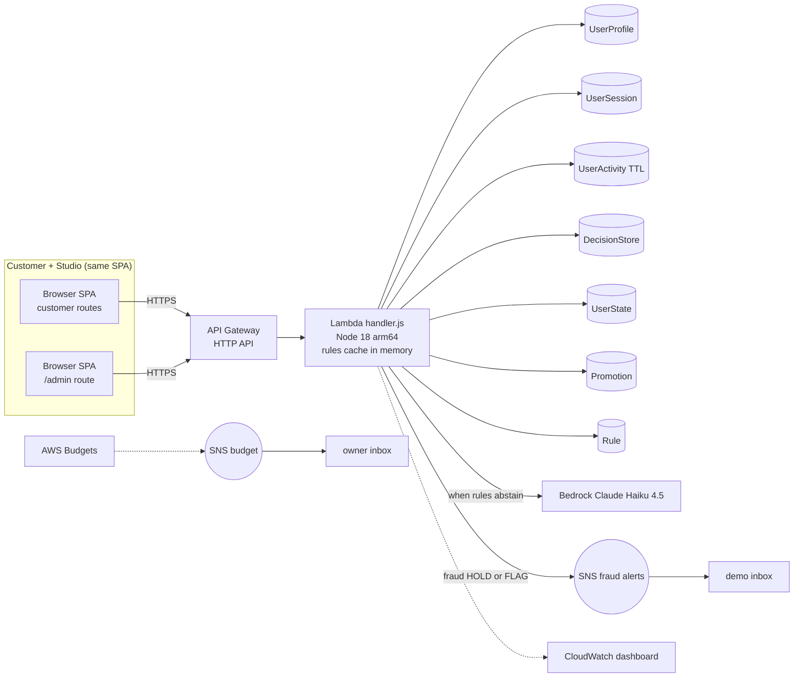
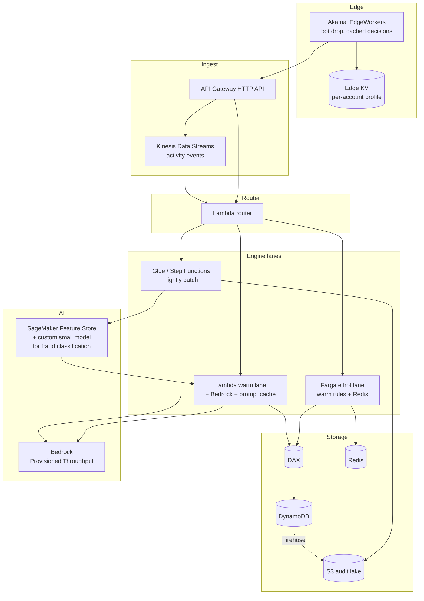

# Signal Force Architecture

A real-time decision intelligence platform. One engine that turns customer signals into adaptive decisions across security, personalization, and engagement. The product is the engine, not any single feature.

## TL;DR

- **Rules-first**, AI when needed. 90% of decisions resolve via deterministic rules in memory. AI gets called only when rules abstain or when a novel pattern shows up.
- **Tiered storage**: browser, edge KV, Lambda memory, Redis, DAX, DynamoDB, S3. Reads collapse at the cheapest tier they can.
- **Three apps share one engine**: customer surface, decision engine, studio (admin + insights + AI rule proposer).
- **The studio loop closes the system**: AI runs nightly on the audit trail, suggests new rules, admin approves, rules go live, AI cost drops as rule coverage grows.
- **Hackathon stack** (now): three CDK stacks, single Lambda, DynamoDB, Claude Haiku 4.5 via the Marriott LiteLLM proxy (OpenAI-compatible, backed by Bedrock), CloudWatch dashboard. Deployed and working.

## Vision

Every customer interaction on a loyalty platform is a decision. Show a promotion or not. Flag a transfer or not. Greet with a personalized nudge or stay quiet. Today these decisions live in silos: fraud team owns one, marketing owns another, CRM owns a third. Signal Force unifies them.

A single engine watches the activity stream. Rules evaluate first, cheaply. AI handles novelty. Every decision is auditable. The studio shows the marketing team what is happening and lets them tune rules without a deploy. Over time the system gets smarter and cheaper at the same time.

## System overview

The full picture, all three apps, all the storage tiers, the studio loop, edge cache, batch pipeline, audit lake. This is where the platform is heading. The demo runs a tractable subset.



The diagram is intentionally dense. Read it in three passes:

1. Follow a customer event: Browser to Edge to API to Router to Hot Lane to DDB and back.
2. Follow a suspicious event: same up to Router, then Warm Lane to Bedrock to SNS plus DDB write.
3. Follow the studio loop: DDB to S3 to Proposer to Bedrock to suggested rules to Studio UI to admin approval to Rule table to next request hot-lane evaluation.

## Three apps

```
+--------------------+      +---------------------+      +----------------------+
| Customer surface   |      | Decision engine     |      | Studio (admin+ops)   |
|                    |      |                     |      |                      |
| Renders decisions: |<---->| Returns typed       |<---->| Rule editor          |
| popups, nudges,    | API  | response per event: | API  | Promotion editor     |
| holds, offers.     |      | { risk, offers,     |      | Insights graphs      |
|                    |      |   nudge, action }   |      | AI rule proposer     |
| Bonvoy app in prod |      |                     |      | Audit log            |
| SPA in demo.       |      | Rules-first, LLM    |      |                      |
+--------------------+      | only when rules     |      | SPA /admin route     |
                            | abstain.            |      +----------------------+
                            +---------------------+
```

| App | Built where (demo) | Built where (production) |
|---|---|---|
| Customer surface | `apps/frontend/` `/login`, `/dashboard` routes | Bonvoy app or SDK embedded on partner sites |
| Decision engine | `apps/backend/src/handler.js` Lambda | Split into hot + warm + cold lanes, see below |
| Studio | `apps/frontend/src/pages/admin/` route in same SPA | Separate app, Cognito-protected |

## Rules-first engine: AI when needed, not by default

The central insight. Most decisions are not novel. Past patterns repeat. Make rules first-class.

### Flow



### Rule shape

Rules live in a `Rule` DDB table. JSON shape:

```json
{
  "ruleId": "r_high_velocity_transfer",
  "version": 3,
  "priority": 100,
  "active": true,
  "trigger": "transactions/transfer",
  "conditions": [
    { "field": "context.transfersLast1h", "op": "gt", "value": 5 },
    { "field": "context.amount", "op": "gt_multiple_of_user_avg", "value": 10 }
  ],
  "action": "HOLD",
  "confidence": 0.95,
  "nudge_template": "We paused this transfer for review. Please verify in app.",
  "createdBy": "admin@signal-force",
  "createdAt": "2026-05-19T10:00:00Z",
  "stats": { "matched_30d": 412, "false_positive_rate": 0.02 }
}
```

Rule evaluator walks each active rule for the trigger in priority order. If all conditions match and confidence >= threshold (default 0.85), the engine returns the rule's action deterministically. Otherwise it falls through to the warm lane.

### Why this saves money

- **Real-time AI calls drop by 90%**. From 100M/day to ~10M/day in the optimized model.
- **Rule changes do not require code deploys**. Admin edits a rule in the studio, the engine picks it up within 10 minutes.
- **Decisions are explainable**. Every audit row says which rule fired or why the LLM was called.
- **A/B testing rules is trivial**. Toggle `active`, observe stats, revert if needed.

## Storage tiering

The cost story is shaped by storage as much as compute. Most reads stop early.



| Tier | Use for | Cost per million reads | Latency |
|---|---|---|---|
| Browser localStorage | UI state, last 10 actions, preferences, recently shown offers | $0 | instant |
| Edge KV | User profile, tier, segment, eligibility cache | ~$0.10 | ~10ms |
| Lambda in-memory | Active rules, active promotions | $0 (free during warm) | ~1ms |
| Redis | Decision cache, promotion match cache | ~$0.50 | <5ms |
| DAX | UserProfile, UserState hot reads | ~$1.00 | microsecond |
| DynamoDB | Audit, writes, less-frequent reads | ~$1.25 reads / $1.25/M writes | ~5-10ms |
| S3 | Audit lake, analytics raw | ~$0.40 | seconds (Athena) |

What does not move:
- **Trust signals** (geo, device fingerprint, fraud flags) live server-side only. Never trust the browser.
- **Audit trail** is append-only on DDB, replicated to S3 via Firehose.
- **Rules and promotions** are server-side authoritative. Browser only caches the rendered decision, not the rule.

## Studio loop: AI improving rules over time

This is the loop that compounds value. AI cost drops as rule coverage grows.



The loop:

1. Engine writes every decision to DecisionStore (rule_matched, LLM_called, action, latency, cost).
2. Nightly Firehose batches DDB writes into S3.
3. Glue extracts patterns from cases that hit the LLM (these are the novel cases that we paid for).
4. A separate Bedrock call (cold lane, batch) analyzes the clustered novel cases and proposes new rule candidates with projected coverage and confidence.
5. Studio UI shows the admin a queue of suggested rules with stats: "this rule would have handled 412 of the last 1000 LLM-called decisions with 95% confidence, saving an estimated $X/month."
6. Admin reviews, approves, or rejects with a reason (rejection feeds back into the proposer).
7. Approved rules go live. Engine picks them up on the next 10-min cache refresh.
8. The next batch of audit data shows fewer LLM calls. Loop tightens.

The studio is also where the AI generates **insights graphs**:
- Decision volume per surface, per action
- Rule hit rate per rule (which rules earn their keep)
- Novel pattern frequency over time (is the world changing?)
- Fraud catch rate vs false positive rate
- Promotion conversion by segment

## Demo architecture (what we ship for the hackathon)

A tractable subset of the full picture. Three CDK stacks. One Lambda. No edge KV, no Redis, no Kinesis. Rules cached in Lambda memory. LLM called when rules abstain.



Seven DynamoDB tables now: the original five plus `Promotion` and `Rule`. Both new tables land in the next runtime-stack PR.

## Production architecture (where this grows)

The shape it takes at Bonvoy scale.



What changes:
- **Edge layer added**: Akamai EdgeWorkers + Edge KV for per-account profile cache.
- **Engine split**: Fargate for the hot lane (warm rule cache, persistent Redis connections). Lambda for the warm LLM lane (sporadic, fine to cold-start). Glue for cold batch.
- **DAX in front of DDB**: microsecond reads on the hot tables.
- **Bedrock Provisioned Throughput**: commit to a base TPS for 30-70% discount.
- **SageMaker Feature Store**: real-time features for fraud classification, fed by Kinesis.
- **Custom fraud model on SageMaker**: trained on DecisionStore replay set, replaces some Bedrock calls with cheaper inference for the well-understood fraud branch.

## Cost (demo)

| Service | Cost over the event |
|---|---|
| Lambda, API Gateway, DynamoDB (free tier) | $0.00 |
| Claude Haiku 4.5 via LiteLLM proxy (~500 calls) | ~$0.80 |
| SNS, CloudWatch, S3 (free tier) | $0.00 |
| AWS Budgets | ~$0.10 |
| **Total** | **~$1.00** |

The $250 cap is not at risk. Production cost modelling lives outside this document.

## Endpoints (demo set)

| Method | Path | Purpose |
|---|---|---|
| POST | `/auth/login` | Username + password, Basic Auth client cred |
| POST | `/auth/mfa` | Static OTP verification |
| GET | `/dashboard` | User summary, recent activity, recent decisions |
| POST | `/transactions/transfer` | Points transfer with fraud check |
| **POST** | **`/decisions/evaluate`** | **Unified endpoint, takes user + event + context, returns `{ risk, offers, nudge, action, ruleMatched, llmCalled }`** |
| GET | `/admin/decisions` | Audit trail of recent decisions |
| GET | `/admin/rules` | List active rules |
| POST | `/admin/rules` | Create or update a rule |
| GET | `/admin/promotions` | List promotions |
| POST | `/admin/promotions` | Create or update a promotion |
| GET | `/admin/insights` | AI-generated insights (graphs data, suggested rules) |

`/decisions/evaluate` is the central endpoint. It replaces three separate calls (fraud check, offers, nudge) with one and returns whether a rule fired or the LLM was called. The studio uses the same audit data to compute insights.

## Decision flows

### Unified evaluate, rules-first

```
client                Lambda                       DDB                              Bedrock        SNS
  | POST /decisions/evaluate { userId, event, context }
  +-------------------->| check Redis decision cache (5 min TTL)
  |                     |   hit -> return cached, done
  |                     |   miss:
  |                     | load rules from in-memory cache
  |                     |   if stale (>10 min) reload from Rule table
  |                     +---------------------------->|
  |                     |<----------------------------+
  |                     | read UserState, recent UserActivity
  |                     +---------------------------->|
  |                     |<----------------------------+
  |                     | evaluate rules in priority order
  |                     |
  |                     | if any rule matches with confidence >= 0.85:
  |                     |   action = rule.action
  |                     |   nudge = rule.nudge_template
  |                     |   offers = match Promotion table by user segment
  |                     |   write DecisionStore (rule_matched=ruleId)
  |                     |   cache in Redis
  |                     |   skip LLM
  |                     |
  |                     | else (rules abstain, ~10% of cases):
  |                     |   call Bedrock Converse ----------------------------------->|
  |                     |   prompt = compact context + matched-but-low-confidence rules + ambiguity reason
  |                     |   response = { action, nudge, rationale, suggested_rule_pattern }
  |                     |<-------------------------------------------------------------+
  |                     |   write DecisionStore (rule_matched=null, llm_called=true)
  |                     |   if action in (HOLD, FLAG):
  |                     |     publish to fraud-alert SNS -------------------------------------->|
  |                     |   cache in Redis
  |                     |
  |                     +-------------------------->| write DecisionStore
  |<--------------------+ 200 { risk, offers, nudge, action, decisionId, ruleMatched, llmCalled }
```

### Studio nightly rule proposing

```
cron (1:00 AM UTC)
  -> Glue ETL job: read S3 audit lake, extract decisions from last 24h where llm_called=true
  -> bucket by similarity (event type, action, context cluster)
  -> for each bucket with size > N (e.g., 50 cases):
       -> Bedrock call: "given these 50 cases, propose a rule that would handle them deterministically. Return JSON {conditions, action, confidence, projected_coverage}"
       -> write proposal to RuleSuggestion table with status=PENDING
  -> studio UI shows pending suggestions to admin
       -> approve: write to Rule table, set status=APPROVED
       -> reject + reason: keep in suggestions with status=REJECTED, feeds back to next batch prompt
```

### Admin live rule edit

```
admin                 Lambda                       DDB
  | PUT /admin/rules/r_high_velocity_transfer { ... }
  +-------------------->| validate JSON shape
  |                     | PutItem on Rule table (version bumps)
  |                     +---------------------------->|
  |<--------------------+ 200 { ruleId, version }

The change is live for new requests within 10 minutes (rule cache refresh interval).
A hot-reload endpoint can be added later if real-time is needed.
```

## AI brain (L2 modules)

Two L2 modules live in `apps/backend/src/engine/`:

### AI fraud explainer (`ai-fraud-explainer.js`)

Triggered after every `FRAUD_LOGIN` or `FRAUD_TRANSFER` decision where `action` is `BLOCK`, `REVIEW`, or `MFA`. Sends a structured prompt to the LiteLLM proxy and returns a `{ paragraph, riskFactors[], recommendation }` object stored on the decision row as `aiExplanation`. The DecisionDrawer "AI Analysis" panel in the admin console renders this inline.

Constraints:
- Hard 2 s `AbortSignal` timeout. Returns null on timeout; the decision proceeds without a rationale.
- Budget guard (`engine/budget.js`) blocks the call when the daily LLM call cap is hit.
- Falls back silently (no error to the caller) when `LITELLM_BASE_URL` or `LITELLM_API_KEY` is absent.

### AI surface prioritizer (`ai-surface-prioritizer.js`)

Activated on `GET /customer/surface-eligibility?aiMode=on`. After the deterministic `evaluateSurfaces()` call produces a 6-surface candidate list, the prioritizer sends those surfaces plus user context (tier, loyalty score, profile completion, recent SDK signals) to L2 and receives per-surface verdicts.

Each verdict carries:
- `aiAction`: `PROMOTE` | `KEEP` | `DEMOTE` | `HIDE` | `SWAP`
- `aiPriority`: 1 (show first) through 5 (least relevant)
- `aiRationale`: 1-2 sentences for a product manager

The deterministic `state` from the surface evaluator is the source of truth and is never overridden by AI. AI fields are additive. The response includes `aiUnavailable: true` when the LLM is unreachable.

Cache: in-memory Map keyed by `(userId + surface-state-hash)`, 30 s TTL per Lambda container. No DDB.
Timeout: 6 s (raised from 3 s in PR #124).

### LiteLLM topology

```
Lambda engine modules
  |
  | LITELLM_BASE_URL (OpenAI-compatible REST)
  v
LiteLLM Cloudflare Worker proxy
  |
  | Bedrock Converse API
  v
us.anthropic.claude-haiku-4-5-20251001-v1:0
  (US cross-region inference profile)
```

Active model: `us.anthropic.claude-haiku-4-5-20251001-v1:0`. The Lambda does not need direct
Bedrock model activation because the proxy handles it. Three env vars are read at runtime:
`LITELLM_BASE_URL`, `LITELLM_API_KEY`, `LITELLM_MODEL`. These are injected into the Lambda
at CDK synth time via `process.env` in `infra/cdk/lib/runtime-stack.ts` (PR #100). Updating
them requires a CDK deploy, not just a Lambda env var update, because Lambda Versions snapshot
env vars immutably at publish time.

### Budget guard (`engine/budget.js`)

Tracks LLM calls in an in-memory counter (per Lambda container). Reads `LLM_DAILY_BUDGET_USD`
from the env (or `LLM_GUARD_MAX_CALLS` for a call-count ceiling). When the ceiling is hit,
`budget.tryReserve()` returns `{ ok: false }` and both AI modules skip the LLM call. The daily
spend is visible in the admin overview tile at `/admin` under "Engine Guard".

## Stateful surfaces (GET /customer/surface-eligibility)

The surface evaluator (`engine/surfaces.js`) tracks lifecycle state per user for six named surfaces. State is derived from `UserProfile` and `UserState` fields at read time - there is no separate state row.

Surface lifecycle:

```
HIDDEN  --[threshold crossed]--> SHOWN
SHOWN   --[action taken]-------> PENDING
PENDING --[mutation applied]---> COMPLETED (within 60 s window)
SHOWN   --[goal reached]-------> HIDDEN  (e.g. user already at top tier)
```

The six surfaces and their trigger thresholds:

| Surface ID | Shown when | Completed when |
|---|---|---|
| `PROPERTY_PRESTIGE_ADVANCE` | `loyaltyScore` within 10,000 pts of Platinum | `platinumReachedAt` within last 60 s |
| `RESULTS_PRESTIGE_ADVANCE` | Same threshold as above | Same |
| `PROFILE_CATALYST_ELEVATE` | `profileCompletion < 90` and tier below Platinum | `profileCompletionReachedAt` within last 60 s |
| `MFA_ENROLLMENT_NUDGE` | Gold or Platinum member without `mfaSecret` | `mfaEnrolledAt` within last 60 s |
| `TRANSFER_ABANDON_OFFER` | Stale `transferDraft` in UserState (>60 s old) | `lastTransferCompletedAt` within last 60 s |
| `BOOKING_CONFIRMATION_OFFER` | `recentBookingAt` within last 300 s | `bookingOfferDismissedAt` set after booking |

The DemoPanel "Quick Mutations" row fires `POST /admin/demo-actions/mutate-user` to flip these fields directly so a presenter can walk through any surface state during a live demo.

## Demo events and activity feed

### Demo events (`routes/admin/demo-events.js`)

`POST /admin/demo-events` records operator actions from the DemoPanel as `DEMO_EVENT` rows in
`UserActivity`. Each row carries a `type` (e.g. `USER_SWITCH`, `MFA_FORCED`, `SIGNAL_TRIGGER`),
an optional `actor`, and a free-form `payload`. The activity feed and the admin live-ticker
display these alongside real decisions and sessions.

### Activity feed (`routes/admin/activity-feed.js`)

`GET /admin/activity-feed?since=<epochMs>&limit=<n>` merges three sources into one
chronological stream:

1. `DecisionStore` rows with `timestamp > since`
2. `UserSession` ACCESS rows with `lastActivityAt > since`
3. `UserActivity` rows with `activityType = DEMO_EVENT` and `timestamp > since`

Events are sorted newest-first, capped at 100, and returned with a `nextCursor` (epoch ms of
the newest event) for incremental polling. The `kind` field distinguishes each source:
`DECISION`, `SESSION`, or `DEMO_EVENT`. The `LiveActivityFeed` hero widget on the admin
overview polls this endpoint every few seconds.

## DynamoDB tables (as deployed)

Six tables in `signal-force-dynamodb`. All PAY_PER_REQUEST with PITR enabled.

| Table | PK | SK | GSI | Stores |
|---|---|---|---|---|
| `UserProfile` | `userId` (S) | - | `username-index` (PK: `username`) | Loyalty member directory, MFA secret, tier, profile fields |
| `UserSession` | `sessionId` (S) | - | `userId-index` (PK: `userId`) | Bearer sessions. `recordType: ACCESS` for active tokens, `CHALLENGE` for MFA challenges |
| `UserActivity` | `userId` (S) | `activityTime` (N) | - (TTL on `ttl`) | Append-only event log per user. DEMO_EVENT rows share this table |
| `DecisionStore` | `decisionId` (S) | - | `userId-timestamp-index` (PK: `userId`, SK: `timestamp`) | Every engine decision. GSI enables per-user queries with time range in `KeyConditionExpression` |
| `UserState` | `userId` (S) | - | - | Rolling counters and surface lifecycle timestamps per user |
| `EngagementRules` | `ruleId` (S) | `version` (S) | - | Rule documents. `version=latest` is the live row; ISO timestamps are history entries |

The `DecisionStore` GSI (`userId-timestamp-index`) is used by `GET /admin/decisions?userId=` to
query by user with a timestamp range in the `KeyConditionExpression` (not a `FilterExpression`),
giving O(log n) lookup instead of a table scan (PR #88, #94).

## MFA implementation

The demo Lambda runs with `MFA_MODE=static` and `DEMO_MODE=1` (both hardcoded in the CDK
runtime stack). `MFA_MODE=static` means any login or transfer MFA challenge accepts OTP
`123456` as a fallback alongside real TOTP codes. The `mfaPath` field in the response
records which path succeeded (`TOTP` or `STATIC`) for audit purposes.

The TOTP secret is stored as `mfaSecret` on the `UserProfile` item. A challenge `CHALLENGE`
row is written to `UserSession` when the fraud engine returns `action: MFA`. After
`POST /auth/mfa/verify` accepts the code, an `ACCESS` row is written keyed by the opaque bearer
token, so token lookup is O(1) without a secondary index. Every authenticated customer request
calls `validateBearer`, which also slides the row's `expiresAt` forward by `SESSION_TTL_SEC`
(default 1800 s).

## Frontend components added since 2026-05-20

- `DemoPanel` - Surface Eligibility section, Quick Mutations row, AI Mode toggle (PRs #103, #111, #122)
- `LiveActivityFeed` - hero widget on admin overview, merges all event kinds (PR #112)
- `DecisionDrawer` - "AI Analysis" panel renders `aiExplanation` from fraud decisions (PR #122)
- Engine guard tile - black-themed, compact, sub-cent USD cost display (PRs #117, #118)
- TopBar dec/s meter - switched to TanStack Query with EMA smoothing (PR #106)
- Force-MFA-on-demo checkbox on login page when `DEMO_MODE=1` (PR #96)
- Engagement detectors wired on `/search`, `/results`, `/property`, `/transfer`, `/profile` (PR #97)

## Stacks

Three CDK stacks (six DynamoDB tables is accurate; the "Promotion" and "Rule" references in older docs are stale - those tables were replaced by `EngagementRules`). All on `main`.

| Stack | Status | Contents |
|---|---|---|
| `signal-force-dynamodb` | deployed | 6 DynamoDB tables: UserProfile, UserSession, UserActivity (TTL), DecisionStore, UserState, EngagementRules |
| `signal-force-budgets` | deployed | 3 monthly budgets (25 / 100 / 200 USD) with SNS email alerts |
| `signal-force-runtime` | deployed | Lambda + HTTP API + IAM + Bedrock IAM (prod-path, unused on LiteLLM demo path) + fraud-alert SNS + CloudWatch dashboard |

## Service selection (demo stack)

### Compute: Lambda Node.js 18 arm64

For the demo. For production the hot lane moves to Fargate (warm rule cache, persistent Redis connections, no cold starts). Lambda stays for the warm LLM lane and the cold batch jobs.

Python is the next major rewrite for the engine (better Powertools, SageMaker integration, larger LLM ecosystem). Not for the demo.

### API: API Gateway HTTP API

HTTP API, not REST. Cheaper, faster, sufficient.

### Storage: DynamoDB on-demand

Seven tables (existing five plus Promotion and Rule). PAY_PER_REQUEST. RemovalPolicy.DESTROY for the demo. Production flips to RETAIN and adds DAX.

### LLM: Marriott LiteLLM proxy (Claude Haiku 4.5 on Bedrock, OpenAI-compatible)

- Demo path: `LITELLM_BASE_URL`, `LITELLM_API_KEY`, `LITELLM_MODEL` on the Lambda. The proxy speaks OpenAI wire format and routes to Bedrock, so the Lambda does not need direct Bedrock model access.
- Active model id: `us.anthropic.claude-haiku-4-5-20251001-v1:0` (US cross-region inference profile).
- Switchable catalog: see `apps/backend/src/lib/aiModels.js`, surfaced in the admin UI at `/admin/settings`. Budget tier (Gemini 2.5 Flash Lite, Nova Micro / Lite, Llama 3.x) for high-volume scoring under the demo cap. Standard tier (Haiku, Sonnet) for quality.
- Called by the L2 AI fraud explainer (post-decision) and the AI surface prioritizer (on-demand via `?aiMode=on`). Also called by the admin rule editor AI Assist feature.
- Production alternate: direct Bedrock Converse API with Provisioned Throughput. The CDK Bedrock IAM policy is retained for that path. Unused on the LiteLLM path.
- See "AI brain" section above for timeout, budget guard, and cache details.

### Frontend hosting

S3 static hosting for the demo. CloudFront optional polish.

## Decision log

Each decision is closed. Reopening requires written rationale in a PR description.

1. **CDK TypeScript over CloudFormation YAML.** Type safety, L2 constructs, cdk diff workflow.
2. **HTTP API over REST API.** Cheaper, faster, sufficient.
3. **Single Lambda for the demo, tiered compute at scale.** Hot lane to Fargate, warm to Lambda, cold to Glue.
4. **Claude Haiku 4.5 via the Marriott LiteLLM proxy.** OpenAI-compatible wire format, Bedrock-backed, no direct Bedrock activation needed on the Lambda for the demo. Production alternate: direct Bedrock Converse with Provisioned Throughput.
5. **Static MFA OTP over Cognito for the demo.** Half day saved. Cognito JWT (no MFA) is the next upgrade.
6. **Rules-first engine. AI when rules abstain.** 90% of decisions resolve via deterministic rules. LLM share drops over time as the studio loop adds rules.
7. **Three apps, one repo, one backend, two frontends (or two routes).** Customer + studio share the SPA in the demo. Production splits.
8. **Node.js for the demo, Python at the next major rewrite.** Better ML/LLM ecosystem.
9. **No Step Functions, Kinesis, EventBridge in the demo.** All correct at scale. None earn complexity at demo traffic.
10. **Tiered storage: browser, edge KV, Lambda memory, Redis, DAX, DDB, S3.** Reads stop at the cheapest tier they can.
11. **Studio AI runs in batch, not real-time.** Nightly pattern mining and rule proposing. Admin approval gate before live.
12. **Pre-cached LLM outputs over real-time LLM** for personalization. Daily batch generates offer variants per segment. Render-time pick is deterministic.

## Hackathon scope

In scope for the demo:

- Unified `/decisions/evaluate` endpoint with rules-first evaluation
- `Rule` and `Promotion` DDB tables, in-memory rule cache in the Lambda
- Studio SPA route with audit log, rule editor, promotion editor
- AI insights panel in the studio (one LiteLLM call generates a written insight on the current audit data)
- Three demo scenarios (clean user, suspicious transfer, admin rule change taking effect live)

## Operational notes

- Region: us-east-1.
- Demo path uses the Marriott LiteLLM proxy, so no Bedrock model activation is required on the demo AWS account. Set `LITELLM_BASE_URL`, `LITELLM_API_KEY`, and `LITELLM_MODEL` on the Lambda (`./scripts/enable-litellm.sh` does this in one step).
- The production-path Bedrock IAM policy is retained in `infra/cdk/lib/runtime-stack.ts`. If the Lambda is ever switched to call Bedrock directly, Bedrock model access for Claude Haiku 4.5 in us-east-1 must be enabled in the AWS console first.
- Set `BUDGET_ALERT_EMAIL` and `FRAUD_ALERT_EMAIL` before `cdk deploy`.
- Confirm both SNS subscription emails after the first deploy.
- CloudWatch log groups have 1-day retention by default.
- Rule cache TTL in Lambda is 10 minutes. Set lower for faster admin feedback during the demo.

## References

- API Gateway HTTP API + Lambda + DynamoDB: https://docs.aws.amazon.com/apigateway/latest/developerguide/http-api-dynamo-db.html
- Bedrock Converse API + cost attribution: https://docs.aws.amazon.com/bedrock/latest/userguide/cost-management.html
- Bedrock Provisioned Throughput: https://docs.aws.amazon.com/bedrock/latest/userguide/prov-throughput.html
- Anthropic prompt caching: https://docs.anthropic.com/en/docs/build-with-claude/prompt-caching
- DDoS resiliency whitepaper: https://docs.aws.amazon.com/whitepapers/latest/aws-best-practices-ddos-resiliency/protecting-api-endpoints-bp4.html
- CDK API reference: https://docs.aws.amazon.com/cdk/api/v2/
- DAX: https://docs.aws.amazon.com/amazondynamodb/latest/developerguide/DAX.html
- json-rules-engine (one option for the rule evaluator): https://github.com/CacheControl/json-rules-engine
