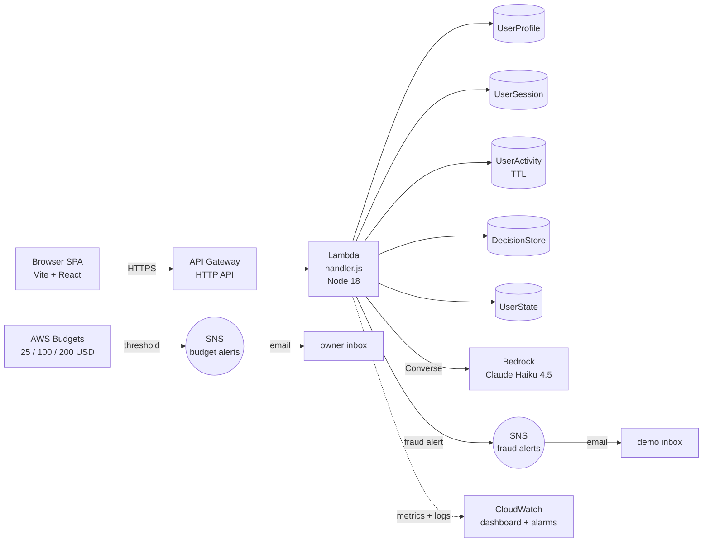

# Signal Force Architecture

Fraud-aware loyalty platform. Serverless on AWS. This document is the contract for what we build and what we deliberately do not build.

## TL;DR

- Single Lambda behind an API Gateway HTTP API, routing all paths.
- DynamoDB on-demand for state, five tables, no relational store.
- Amazon Bedrock (Claude Haiku 4.5) via the Converse API for personalized offers and adaptive nudges, called only when fraud risk crosses a threshold.
- SNS topic for fraud alerts to email. CloudWatch dashboard for the demo storyline.
- Static MFA OTP in the demo. No Cognito.
- No CloudFront, no WAF, no Step Functions, no Kinesis, no SageMaker.
- IaC is CDK in TypeScript. Three stacks: `signal-force-dynamodb`, `signal-force-budgets`, `signal-force-runtime`.

Expected total event cost across the platform: under $5.

## Service map



ASCII fallback:

```
+----------------+     HTTPS      +----------------+      +----------------+
| Browser SPA    +--------------> | API Gateway    +----> | Lambda         |
| Vite + React   |                | HTTP API       |      | handler.js     |
+----------------+                +----------------+      +-+--+--+--+--+--+
                                                            |  |  |  |  |
                                                            v  v  v  v  v
                                                  UserProfile / UserSession /
                                                  UserActivity (TTL) /
                                                  DecisionStore / UserState
                                                  (DynamoDB PAY_PER_REQUEST)
                                                            |
                                              Converse API  |
                                                            v
                                                  +----------------+
                                                  | Bedrock        |
                                                  | Claude Haiku   |
                                                  +----------------+
                                                            |
                                                  fraud alert
                                                            v
                                                  +----------------+
                                                  | SNS            +--> email
                                                  +----------------+
```

## Stacks

Three CDK stacks. Two already exist on `main`. One is to be built.

| Stack | Status | Contents |
|---|---|---|
| `signal-force-dynamodb` | built | 5 tables: UserProfile, UserSession, UserActivity (TTL), DecisionStore, UserState |
| `signal-force-budgets` | built | 3 monthly budgets (25 / 100 / 200 USD) with SNS email alerts |
| `signal-force-runtime` | to build | Lambda + HTTP API + IAM + Bedrock permissions + fraud-alert SNS topic + CloudWatch dashboard |

We intentionally keep stateful resources (DynamoDB) in their own stack. Removing a Lambda or rolling back the runtime stack does not touch tables.

## Service selection and rationale

### Compute: AWS Lambda (Node.js 18)

- Pay per millisecond, no idle cost.
- Generous free tier (1M requests/month, 400k GB-seconds/month) covers the entire event with margin.
- Single function with internal path routing. We do not split per route; the overhead of multiple Lambdas (deployment surface, log groups, cold starts) is not worth it at this scale.
- Memory: 512 MB. Enough for the SDK + Bedrock client without making cold starts expensive.

### API: API Gateway HTTP API

- HTTP API, not REST API. Cheaper, lower latency, simpler. We do not need the REST API features (request validation models, API keys, usage plans).
- Single proxy integration to the Lambda. The handler reads `event.requestContext.http.method` and `event.requestContext.http.path` to route.
- Per-route throttling via `defaultRouteSettings` in CDK if we want to demo a rate limit. No extra cost.

### Storage: DynamoDB on-demand

- Five tables. Schema in `seed_data/`. Already deployed via the dynamodb stack.
- PAY_PER_REQUEST. No capacity planning, no idle cost.
- `RemovalPolicy.DESTROY` for the demo. Production would flip to `RETAIN`.
- DynamoDB Streams not enabled. We do not need cross-table consistency in v1.

### Generative AI: Amazon Bedrock with Claude Haiku 4.5

- Used for two product features: personalized offers and adaptive nudges (the message shown when a fraud signal triggers a hold).
- Called via the Converse API (`@aws-sdk/client-bedrock-runtime` `ConverseCommand`). Converse is the 2026 unified path, swapping models later is one line.
- Model access must be enabled in the Bedrock console per region. Do this on day one.
- Cost: $0.80 per 1M input tokens, $4.00 per 1M output tokens. At our expected volume (under 1k calls), the entire event costs under $1.
- Called **only on the suspicious branch** of the fraud check. Normal traffic never invokes Bedrock. This keeps cost low and makes the demo story sharp: "watch what happens when the score crosses 60."

### Frontend hosting: S3 + CloudFront (deferred decision)

- For the demo we serve the Vite build via S3 with static website hosting.
- If we have time, front it with CloudFront for HTTPS and a clean domain. Not blocking.

## Request flows

### Login with static MFA

```
client                  Lambda                            DynamoDB
  | POST /auth/login       |                                |
  | { username, password } |                                |
  +----------------------->| validate Basic Auth header     |
  |                        | look up user in UserProfile    |
  |                        +------------------------------->|
  |                        |<-------------------------------+
  |                        | check pw hash                  |
  |                        | create UserSession row         |
  |                        +------------------------------->|
  |<-----------------------+ 200 { sessionId, mfaRequired:true }
  |                                                         |
  | POST /auth/mfa { sessionId, otp }                       |
  +----------------------->| compare otp to static value    |
  |                        |   (env var MFA_OTP)            |
  |                        | mark UserSession.status=active |
  |                        +------------------------------->|
  |<-----------------------+ 200 { token }                  |
```

The static OTP is a single env var the team agrees on for the demo. The MFA prompt is a real UI element. Judges will not authenticate themselves.

### Points transfer with layered fraud check

```
client              Lambda                       DynamoDB                Bedrock              SNS
  | POST /transactions/transfer { from, to, amount }
  +------------------>| pull recent transfers from UserActivity (last 1h)
  |                   +-------------------------->|                       |                    |
  |                   |<--------------------------+                       |                    |
  |                   | compute heuristic score                            |                    |
  |                   |   velocity + amount + IP/device delta              |                    |
  |                   |                                                    |                    |
  |                   | if score < 60: APPROVE                             |                    |
  |                   |   write DecisionStore (status=APPROVED)            |                    |
  |                   |   append to UserActivity                           |                    |
  |                   +-------------------------->|                       |                    |
  |<------------------+ 200 { status: APPROVED, decisionId }              |                    |
  |                                                                       |                    |
  |                   | if score >= 60: HOLD                              |                    |
  |                   |   call Bedrock Converse for an adaptive nudge ----+------------------> |
  |                   |<-------------------------------------------------+ (nudge text)        |
  |                   |   write DecisionStore (status=HOLD, score, nudge)|                     |
  |                   +-------------------------->|                       |                    |
  |                   |   publish fraud-alert SNS  |                                            |
  |                   +-------------------------------------------------------------------- -->|
  |<------------------+ 200 { status: HOLD, nudge, decisionId }                                 |
```

The threshold (60) lives as an env var. Adjustable without redeploy.

### Personalized offers

```
client              Lambda                       DynamoDB              Bedrock
  | GET /offers?userId=...
  +------------------>| read UserState (tier, points, recent categories)
  |                   +-------------------------->|
  |                   |<--------------------------+
  |                   | call Bedrock Converse with a structured prompt
  |                   |   asking for 3 offer variants                ---->|
  |                   |<--------------------------------------------------+
  |<------------------+ 200 { offers: [...] }
```

The Lambda parses the model response into a typed list. If parsing fails, fall back to a static offer list. This protects the demo from a bad model output.

## Decision log

Each decision is closed. Reopening requires a written reason in a PR description.

1. **CDK in TypeScript over CloudFormation YAML.** Two devs have TypeScript comfort. CDK gives us type safety, L2 constructs with secure defaults, and `cdk diff` before deploy. CDK synthesizes to CloudFormation, so the underlying template is still auditable if anyone asks.

2. **API Gateway HTTP API over REST API.** Cheaper, lower latency, simpler. We do not need REST features. The trade-off is per-stage throttling controls and we accept that.

3. **Single Lambda over per-route functions.** Less deployment surface, fewer log groups, one cold start to optimize. Internal routing in `handler.js`. We split later only if traffic patterns demand it (they will not, this is a demo).

4. **Bedrock with Claude Haiku 4.5 over SageMaker Serverless Inference.** SageMaker requires training a model, packaging an endpoint, and managing inference cost. Haiku via Bedrock is a one-line API call, generates text not a probability score, and gives us the adaptive nudge feature for free. Cost is negligible.

5. **Static MFA OTP over Cognito.** Cognito User Pools with MFA require frontend changes (challenge response handling), backend changes (JWT verification, removing Basic Auth), and user pool provisioning. That is a full day for the 1-2 people on infra. The demo does not need real TOTP. Cognito for JWT only (no MFA) is a worthwhile upgrade only if we land before the last morning.

6. **Skip CloudFront + WAF in front of API Gateway.** The standard guidance covers REST API. HTTP API has no L2 construct for CloudFront origin and requires a manual `x-origin-verify` secret header pattern. The demo does not need rate limiting against the open internet. If we want to demo a throttle, use HTTP API per-route throttling instead.

7. **Layered fraud: heuristics first, Bedrock on suspicion.** A pure-LLM fraud detector is slow and expensive. A pure-heuristic detector is what judges have seen from every team. The layered approach is fast for normal traffic, uses the LLM only where it adds visible value, and creates a clear demo story.

8. **No Step Functions, no Kinesis, no EventBridge.** All of these are correct production patterns. None of them earn their complexity for a two-day demo where traffic is a single human clicking through flows.

## Cost estimate

Assumptions: 1,000 API calls over the event, 10 users, 100 fraud decisions written, 500 Bedrock calls at 1k input / 200 output tokens each.

| Service | Free tier coverage | Estimated event cost |
|---|---|---|
| Lambda | 1M req / 400k GB-s monthly, permanent | $0.00 |
| API Gateway HTTP API | 1M calls / 12 months for new accounts | $0.00 |
| DynamoDB (5 tables, on-demand) | 200M requests + 25 GB storage, permanent | $0.00 |
| Bedrock Claude Haiku 4.5 | none, on-demand pay-per-token | $0.80 |
| SNS email notifications | 1,000 emails monthly free | $0.00 |
| CloudWatch dashboards + alarms | 3 dashboards, 10 alarms, 5 GB ingest | $0.00 |
| S3 (frontend hosting) | 5 GB storage + 20k GET / 12 months | $0.00 |
| AWS Budgets | first 2 budgets free, then $0.02/budget/day | ~$0.10 |
| **Total** | | **~$1.00** |

The $250 platform cap is not at risk. The largest variable is Bedrock token usage. Five thousand calls (10x baseline) is still under $10.

One real cost surprise to avoid: if anyone enables verbose API Gateway access logging plus a load test, CloudWatch Logs ingestion ($0.50 per GB) can climb fast. Mitigation: log retention is set to 1 day on every log group, and we delete log groups after the event.

## Operational concerns

- **Region**: us-east-1. Bedrock model access is enabled there. Tables, Lambda, and SNS all go in the same region.
- **Bedrock model access**: one-time enable in the Bedrock console for Anthropic Claude Haiku 4.5 in us-east-1 before any Lambda invocation. The console walks you through it.
- **CDK bootstrap**: one-time per account/region, `cdk bootstrap aws://<ACCOUNT>/us-east-1`.
- **Budget alarms**: confirm the SNS subscription email after the first deploy. AWS sends a confirmation link.
- **Secrets**: `CLIENT_ID`, `CLIENT_SECRET`, `MFA_OTP` live in Lambda env vars set at deploy time, not in the repo. No KMS for the hackathon. Production would move these to Secrets Manager.

## Out of scope (intentional)

Documented here so the next person knows what we considered and rejected:

- Amazon Cognito User Pools with TOTP MFA (half-day work, demo does not benefit)
- CloudFront + AWS WAF in front of API Gateway HTTP API (no L2 construct, no demo value)
- Step Functions for the points transfer review (over-engineered, single human flow)
- Kinesis Data Firehose for activity stream to S3 (no analytics consumer in v1)
- SageMaker Serverless Inference for fraud ML (Bedrock + heuristics is enough)
- DynamoDB Streams (no consumer)
- EventBridge bus for service decoupling (no second service)

## Post-event upgrade path

If this becomes a real product after the event, the upgrade order:

1. Cognito User Pools for real auth with MFA and JWT-protected API.
2. CloudFront + WAF in front of the API for rate limiting and managed rules on the public endpoints.
3. DynamoDB Streams + a second Lambda for cross-table consistency and activity stream into Firehose -> S3.
4. SageMaker Serverless Inference endpoint for a trained fraud model. Bedrock stays for the nudge text.
5. Step Functions for transfer review workflows once human-in-the-loop becomes part of the product.
6. Secrets Manager for all credentials. KMS for at-rest encryption keys.
7. Multi-region failover. Probably not needed for years.

These are notes, not action items. Do not implement during the demo build.

## References

- API Gateway HTTP API + Lambda + DynamoDB pattern: https://docs.aws.amazon.com/apigateway/latest/developerguide/http-api-dynamo-db.html
- Bedrock Converse API + cost attribution: https://docs.aws.amazon.com/bedrock/latest/userguide/cost-management.html
- DDoS resiliency whitepaper (the reason we are not adding CloudFront for the demo): https://docs.aws.amazon.com/whitepapers/latest/aws-best-practices-ddos-resiliency/protecting-api-endpoints-bp4.html
- CDK API reference: https://docs.aws.amazon.com/cdk/api/v2/
