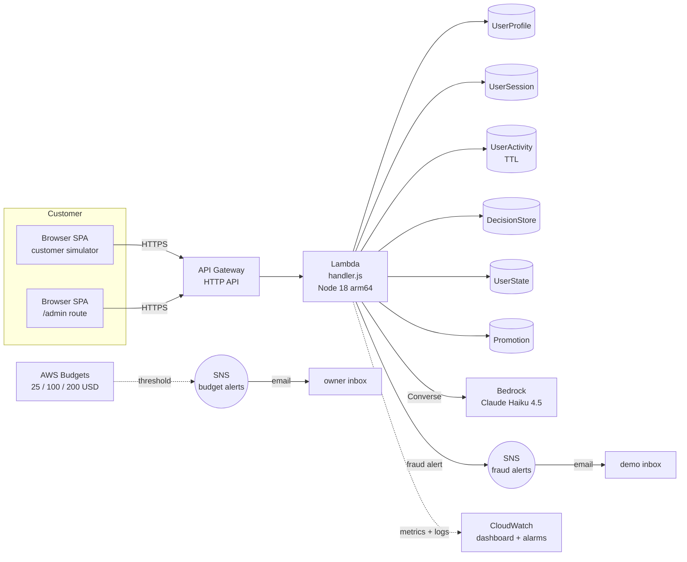
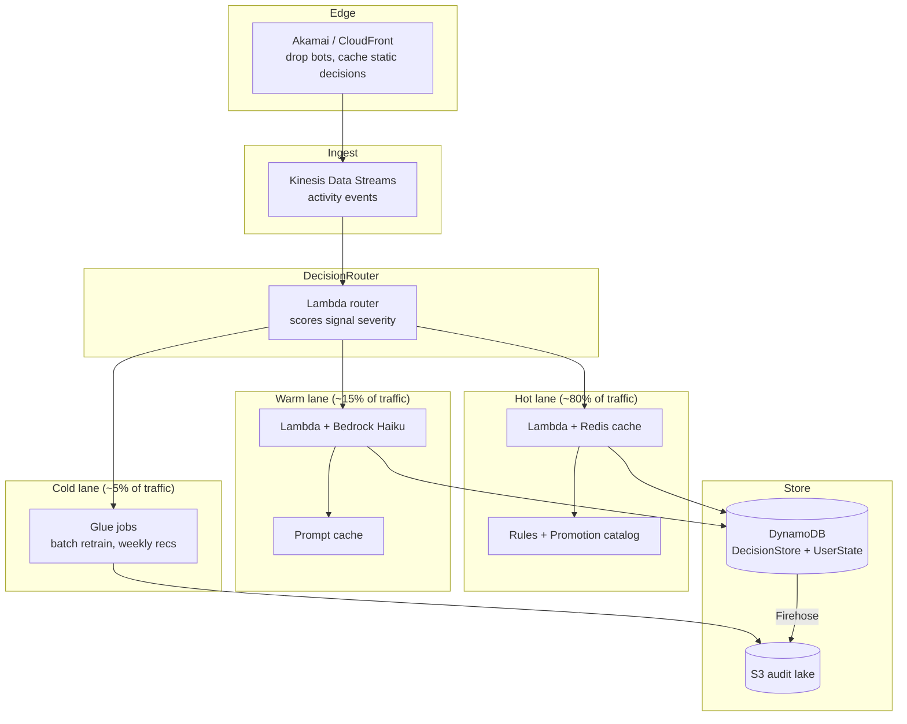

# Signal Force Architecture

A real-time decision intelligence platform. One engine that turns customer signals into adaptive decisions across three surfaces: security, personalization, and engagement. Fraud detection is one decision type. The product is the engine.

## What this document is

The contract for what we build for the demo, the shape it grows into post-event, and the decisions we have closed. If a PR conflicts with this doc, the PR updates the doc first.

## Vision in one paragraph

Every customer interaction on a loyalty platform is a decision. Show a promotion or not. Flag a transfer or not. Greet with a personalized nudge or stay quiet. Today these decisions live in silos: fraud team owns one, marketing owns another, CRM owns a third. Signal Force unifies them. A single engine watches the activity stream, runs every signal through a tiered decision pipeline (rules, ML, LLM), and returns a typed response that the customer surface renders. The marketing team configures promotions in one place. The security team sees fraud holds in the same audit trail. The customer gets a smarter, safer, more personalized experience without knowing the engine exists.

## Three apps, one engine

```
+-------------------+        +-------------------+        +-------------------+
| Customer surface  |        | Decision engine   |        | Admin / ops       |
| (Bonvoy app/site, |        | (this repo's      |        | dashboard         |
| our SPA simulates |<------>| Lambda + DDB +    |<------>| (our SPA,         |
| for the demo)     |  HTTP  | Bedrock)          |  HTTP  | /admin route)     |
+-------------------+        +-------------------+        +-------------------+
                                       ^
                                       |
                             activity stream events
                             (Akamai logs, web hits,
                             API calls in production)
```

| App | Built where | Owner |
|---|---|---|
| Customer surface | `apps/frontend/` routes `/login`, `/dashboard` simulate the Bonvoy experience | UI dev |
| Decision engine | `apps/backend/src/handler.js` Lambda, called by both customer and admin | Backend dev |
| Admin console | `apps/frontend/src/pages/admin/` new route, CRUD on promotions, audit log viewer | UI dev |

The customer surface and the admin console share the same SPA for the demo. In production they are separate apps with separate auth.

## Demo architecture (what we deploy for the hackathon)



Six DynamoDB tables now (added `Promotion`). The Promotion table holds the admin-configured offers. The DecisionStore captures every decision the engine makes (fraud holds, offers shown, nudges fired) so the admin console can replay history.

## Production architecture (where this grows)

The demo runs on a single Lambda. At Bonvoy scale (200M+ members, ~10M DAU, ~100M decisions/day), the engine splits into three lanes by decision complexity.



| Lane | Path | Typical latency | Cost per decision |
|---|---|---|---|
| Hot | Lambda + Redis + rules engine + promotion match | <50ms | ~$0.0001 |
| Warm | Lambda + Bedrock Haiku with prompt cache | <500ms | ~$0.001 |
| Cold | Glue or Step Functions nightly | seconds to minutes (async) | <$0.0001 amortized |

Routing logic, simplified: severity score from rules first. If under low threshold, hot lane (just rules). If between, warm lane (LLM for nuance). If a heavy decision (weekly recommendations, audit summary), queue to cold.

## Cost model at Bonvoy scale

Assumptions: 200M members, 5% DAU = 10M daily active, 10 decisions per user per day = 100M decisions/day.

Naive (no optimization):

| Lane | Calls/day | Per-decision | Daily | Yearly |
|---|---|---|---|---|
| Hot | 80M | $0.0001 | $8,000 | $2.9M |
| Warm (Haiku, ~600 tokens) | 15M | $0.001 | $15,000 | $5.5M |
| Cold (batch) | 5M | $0.00005 | $250 | $90K |
| Infra (Lambda, Kinesis, DDB, S3, Redis) | | | ~$1,500/day | ~$500K |
| **Total naive** | | | | **~$9M/year** |

Optimized:

1. **Bedrock Provisioned Throughput** for Haiku at this volume: 50-70% off the warm lane. Saves ~$3M/year.
2. **Prompt caching** (Anthropic prompt-cache feature): same user context reused for 5 min, ~50% hit rate. Saves ~$1M/year.
3. **Prompt design**: small structured inputs, not 5KB context dumps. 40% token reduction. Saves ~$1.5M/year.
4. **Tier ratios** shift to 90/8/2 once we have learned which decisions LLM actually changes. Saves ~$1M/year.
5. **Edge caching** for non-user-specific decisions (promotion catalog state, A/B variants). 30% off the hot lane. Saves ~$500K/year.

Realistic optimized total: **$1.5M to $2.5M/year for the entire decision layer at Bonvoy full scale**.

Context for the pitch: enterprise loyalty programs lose tens to hundreds of millions per year to fraud. A platform that catches 10% pays for itself many times over before personalization revenue lift enters the model.

## Stacks

Three CDK stacks. All built on `main`.

| Stack | Status | Contents |
|---|---|---|
| `signal-force-dynamodb` | built | UserProfile, UserSession, UserActivity (TTL), DecisionStore, UserState. Adding `Promotion` table next. |
| `signal-force-budgets` | built | 3 monthly budgets (25 / 100 / 200 USD) with SNS email alerts |
| `signal-force-runtime` | built | Lambda + HTTP API + IAM + Bedrock perms + fraud-alert SNS topic + CloudWatch dashboard |

## Service selection (demo stack)

### Compute: AWS Lambda Node.js 18 arm64

- Single function, internal path routing. Cold starts under 200ms with 512 MB on arm64.
- Free tier covers the entire event with margin.
- Choose Python at the next major rewrite. Better Powertools, better SageMaker integration, larger LLM ecosystem. Switching now is not worth the day of work.

### API: API Gateway HTTP API

- HTTP API, not REST. Cheaper, faster, sufficient for our needs.
- Single Lambda integration on `$default` route. Handler reads method and path.

### Storage: DynamoDB on-demand

- Six tables (five existing plus the new Promotion table).
- PAY_PER_REQUEST. No capacity planning.
- `RemovalPolicy.DESTROY` for the demo. Production flips to RETAIN.

### Decision logic: Bedrock Claude Haiku 4.5 via Converse API

- Called only on the warm lane (suspicious branch of the fraud check, personalized offer generation, adaptive nudge text).
- Model ID: `us.anthropic.claude-haiku-4-5-20251001-v1:0` (US cross-region inference profile).
- Cost at demo scale: under $1 total. At Bonvoy scale: see the cost model above.

### Frontend hosting

- S3 static hosting for the demo. CloudFront optional polish.

## Endpoints (demo set)

| Method | Path | Purpose |
|---|---|---|
| POST | `/auth/login` | Username + password with Basic Auth client cred |
| POST | `/auth/mfa` | Static OTP verification |
| GET | `/dashboard` | User summary plus recent activity and decisions |
| POST | `/transactions/transfer` | Points transfer with fraud check |
| POST | `/decisions/evaluate` | Unified endpoint: takes user + context, returns `{ risk, offers, nudge, action }` in one response |
| GET | `/admin/decisions` | Audit trail of recent decisions (read-only for the demo) |
| GET | `/admin/promotions` | List promotions |
| POST | `/admin/promotions` | Create or update a promotion (no auth gate beyond Basic Auth for the demo) |

`POST /decisions/evaluate` is the central endpoint. It replaces three separate calls (fraud check, offers, nudge) with one. The customer surface calls it on key events (login, page view of points balance, transfer initiated). The response tells the frontend what to render.

## Decision flows

### Unified evaluate

```
client                 Lambda                       DDB                              Bedrock              SNS
  | POST /decisions/evaluate { userId, event, context }
  +-------------------->| read UserState, UserActivity, eligible Promotions
  |                     +---------------------------->|                               |                    |
  |                     |<----------------------------+                               |                    |
  |                     | compute heuristic risk score                                |                    |
  |                     |   velocity, geo delta, device delta, amount multiple        |                    |
  |                     | match promotions by eligibility rules + user tier           |                    |
  |                     |                                                              |                    |
  |                     | if risk < threshold: HOT LANE                                |                    |
  |                     |   pick best 3 promotions, generate static nudge text         |                    |
  |                     |                                                              |                    |
  |                     | if risk >= threshold OR has-personalization-flag: WARM LANE  |                    |
  |                     |   call Bedrock Converse with structured prompt -------------> |                    |
  |                     |   prompt asks for: risk classification, nudge text,          |                    |
  |                     |   personalized offer selection from candidates               |                    |
  |                     |<-------------------------------------------------------------+                    |
  |                     |   if risk action == HOLD or FLAG:                                                  |
  |                     |     publish to fraud-alert SNS -------------------------------------------------->|
  |                     |   write DecisionStore (every decision, with score + action + nudge)              |
  |                     +---------------------------->|                                                     |
  |<--------------------+ 200 { risk, offers, nudge, action, decisionId }                                   |
```

### Admin loop

```
admin                  Lambda                       DDB
  | GET /admin/decisions?since=...
  +-------------------->| Query DecisionStore GSI userId-timestamp-index
  |                     +---------------------------->|
  |                     |<----------------------------+
  |<--------------------+ 200 { decisions: [...] }

  | POST /admin/promotions { id, eligibility, payload, expiry }
  +-------------------->| PutItem on Promotion table
  |                     +---------------------------->|
  |<--------------------+ 200 { id }
```

## Hackathon scope vs out-of-scope

In scope for the demo:

- Unified `/decisions/evaluate` endpoint
- Promotion CRUD endpoints
- Admin SPA route with audit log and promotion editor
- Three demo scenarios (clean user, suspicious user, admin rule change)

Intentionally out of scope, listed so the next person knows:

- Cognito User Pools with TOTP MFA (half day work, no judge value)
- CloudFront + WAF in front of API Gateway (no L2 for HTTP API)
- Step Functions for transfer review workflows
- Kinesis Firehose for activity stream (no analytics consumer yet)
- SageMaker Serverless Inference for trained fraud model
- DynamoDB Streams
- EventBridge bus
- The hot/warm/cold lane router (production-scale only, demo runs on a single Lambda)

## Decision log

Each decision is closed. Reopening requires written rationale in a PR description.

1. **CDK TypeScript over CloudFormation YAML.** Type safety, L2 constructs, cdk diff workflow.
2. **HTTP API over REST API.** Cheaper, faster, sufficient features.
3. **Single Lambda for the demo, tiered Lambdas at scale.** Less surface for the demo, clean lane separation for production. Architecture supports the migration without rewriting business logic.
4. **Bedrock Claude Haiku via Converse API.** One-line model call, swap models later. Cheap at hackathon scale, optimizable at production scale.
5. **Static MFA OTP over Cognito for the demo.** Half day saved. Cognito JWT only (no MFA) is the next upgrade if time permits.
6. **Layered fraud: heuristics first, Bedrock on suspicion.** Fast for normal traffic, LLM only where it adds visible value, explainable decision trail.
7. **Three apps, one repo, one backend, three frontends (or three routes).** Reduces surface area for the demo.
8. **Node.js for the demo, Python at the next major rewrite.** Better Powertools, ML/SageMaker integration, LLM ecosystem.
9. **No Step Functions, Kinesis, EventBridge in the demo.** All are correct at scale. None earn complexity at single-human demo traffic.

## Operational notes

- Region: us-east-1.
- Bedrock model access must be enabled in the Bedrock console for Anthropic Claude Haiku 4.5 in us-east-1 before the Lambda can call it.
- Set `BUDGET_ALERT_EMAIL` and `FRAUD_ALERT_EMAIL` before `cdk deploy`.
- Confirm both SNS subscription emails after the first deploy.
- CloudWatch log groups have 1-day retention by default. Delete log groups after the event.

## Post-event upgrade path

Order of work if this becomes a real product:

1. Promote `/decisions/evaluate` to its own dedicated Lambda with its own deployment cadence.
2. Cognito User Pools for real auth on customer and admin surfaces.
3. Split into hot / warm / cold lanes with a router Lambda.
4. Redis (ElastiCache) for the hot lane's promotion-match cache.
5. Kinesis Data Streams for activity ingestion. Firehose to S3 for audit.
6. SageMaker Feature Store for hot personalization features. Custom small model for fraud classification, trained on the DecisionStore replay set.
7. CloudFront + WAF in front of the customer surface. Akamai EdgeWorkers if Marriott already runs Akamai.
8. Secrets Manager for credentials. KMS for at-rest encryption keys.
9. Multi-region failover. Probably year two.

## References

- API Gateway HTTP API + Lambda + DynamoDB: https://docs.aws.amazon.com/apigateway/latest/developerguide/http-api-dynamo-db.html
- Bedrock Converse API + cost attribution: https://docs.aws.amazon.com/bedrock/latest/userguide/cost-management.html
- DDoS resiliency whitepaper: https://docs.aws.amazon.com/whitepapers/latest/aws-best-practices-ddos-resiliency/protecting-api-endpoints-bp4.html
- CDK API reference: https://docs.aws.amazon.com/cdk/api/v2/
- Anthropic prompt caching (production-only): https://docs.anthropic.com/en/docs/build-with-claude/prompt-caching
